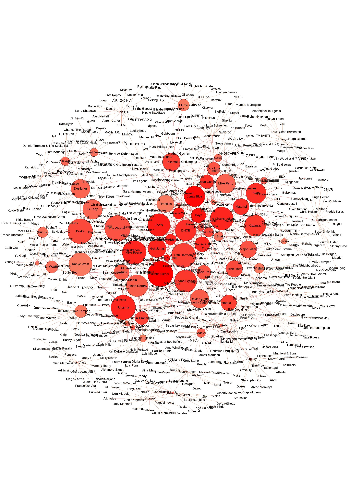

# Rspotify: Access to Spotify API via R


This package allows you to connect R to Spotify's API and get information about Songs, Albums, Artists and Users.

This is an experimental package built up with functions that I've created to attend my specific needs (meaning I wasn't really concerned with errors different than ones I got when it was written). Please, use it with caution. 

So far I haven't uploaded a stable version to CRAN but you can download from GitHub using devtools, type:

```r
library(devtools)
install_github("tiagomendesdantas/Rspotify")
```


In order to access many of the functions you need a authenticated token. You can get one accessing <a href="https://developer.spotify.com/web-api/"> this link</a> to create a Spotify app and get app_id, client_id and client_secret. (Don't forget to put http://localhost:1410/ in Redirect URIs)  


```r
keys <- spotifyOAuth("app_id","client_id","client_secret")
```


To get information about a specific user:
```r
user <- getUser("t.mendesdantas",token=keys)
user$display_name # user name
# [1] "Tiago Dantas"
user$id
# [1] "t.mendesdantas" #user id
user$followers
# [1] 46
```


To search for an artist:
```r
findingregina<-searchArtist("Regina+spektor",token=keys)
```


To get information from an artist using the artist id:
```r
regina<-getArtistinfo("3z6Gk257P9jNcZbBXJNX5i",token=keys)

```

To get information the albums available at spotify from a specific artist:
```r
regina.albums<-getAlbums("3z6Gk257P9jNcZbBXJNX5i",token=keys)
regina.albums$name #name of the albums
# [1] "Kubo and the Two Strings"                         
# [2] "What We Saw From The Cheap Seats"                 
# [3] "What We Saw From The Cheap Seats (Deluxe Version)"
# [4] "Live In London"                                   
# [5] "Far"                                              
# [6] "Far (Deluxe DMD)"                                 
# [7] "Begin To Hope"                                    
# [8] "Begin To Hope (Special Edition)"                  
# [9] "Begin To Hope (U.S. Version)"                     
# [10] "Soviet Kitsch (U.S. Version)"   

```

To get the songs from a specific album:
```r
# getting the songs from the album "what we saw from the cheap seats"
#from Regina Spektor
regina.whatwesaw<-getAlbum("3Etyu2JmgiQTQztLz6RxDX",token=keys) #"3Etyu2JmgiQTQztLz6RxDX" is the album id.

```

To get the features from a specific song:
```r
# getting the song features from "Don't Leave Me [Ne Me Quitte Pas]" 
#from the album "what we saw from the cheap seats" from Regina Spektor
song<-getFeatures("0y5HWbAnJ6qrjeBuFL52hO",token=keys) #"0y5HWbAnJ6qrjeBuFL52hO" is the id for the album.
```

To get the playlists from a specific user:
```r
wh.playlist <- getPlaylist("obamawhitehouse",token=keys) #playlist from the user obamawhitehouse
wh.playlist
#id                                                              name       ownerid  tracks
#1 6ujhXmg8SXjdkdCZ2TchTY            The Bidens' 2016 Summer Playlist thewhitehouse      15
#2 2Zve7PqFSlGl0ojgGnhFTm   The President's 2016 Summer Playlist: Day thewhitehouse      17
#3 0BczR7bDaoKvn3MGPxS9Lx The President's 2016 Summer Playlist: Night thewhitehouse      18
#4 4FDHBIdHPNHCPBqftDc3lk                    Holidays with the Bidens thewhitehouse      17
#5 4qu9a0vwTMyTPpc2YI1GPw                    Holidays with the Obamas thewhitehouse      14
#6 3R2DGCLfGdVqqqN6rdQYr5   The First Lady's Day of the Girl Playlist thewhitehouse      20
#7 4RGLH5YuS6ldp7aCKaTWas        The President's Summer Playlist: Day thewhitehouse      20
#8 3fAriv8eMWELCwbWrhMKy2      The President's Summer Playlist: Night thewhitehouse      20


```


To get the songs from a specific playlist:
```r
#E.g. getting the songs from "Top 100 tracks currently on Spotify" playlist
topsongs <- getPlaylistSongs("spotify","4hOKQuZbraPDIfaGbM3lKI",token=keys)
```


To get a dataframe with related artists:
```r
related<-getRelated("Regina+spektor",token=keys)
related
#                 sourceID     sourceName                names popularity followers                        id
#1  3z6Gk257P9jNcZbBXJNX5i Regina Spektor                Feist         63    336016     6CWTBjOJK75cTE8Xv8u1kj
#2  3z6Gk257P9jNcZbBXJNX5i Regina Spektor            Kate Nash         57    158098     5vBKu1igxFo6g1sHADkIdg
#3  3z6Gk257P9jNcZbBXJNX5i Regina Spektor          Imogen Heap         56    183372     6Xb4ezwoAQC4516kI89nWz
#4  3z6Gk257P9jNcZbBXJNX5i Regina Spektor          Fiona Apple         59    239789     3g2kUQ6tHLLbmkV7T4GPtL
#5  3z6Gk257P9jNcZbBXJNX5i Regina Spektor            She & Him         55    234354     3CIRif6ZAedT7kZSPvj2A4
#6  3z6Gk257P9jNcZbBXJNX5i Regina Spektor    Ingrid Michaelson         68    355511     2vm8GdHyrJh2O2MfbQFYG0
#7  3z6Gk257P9jNcZbBXJNX5i Regina Spektor        A Fine Frenzy         54    130989     5dTYaRzOn4rXGBLH052EeQ
#8  3z6Gk257P9jNcZbBXJNX5i Regina Spektor          Anya Marina         44     23523     6xYBLeSMu1AqPsnUzEvx5n
#9  3z6Gk257P9jNcZbBXJNX5i Regina Spektor     Rachael Yamagata         48     44269     7w0qj2HiAPIeUcoPogvOZ6
#10 3z6Gk257P9jNcZbBXJNX5i Regina Spektor    Jenny Owen Youngs         44     12299     52mkFCABBeP3KjkWFA4M2H
#11 3z6Gk257P9jNcZbBXJNX5i Regina Spektor            Yael Naim         57     60798     3cHwmcXlo7XvovQcl5YxlQ
#12 3z6Gk257P9jNcZbBXJNX5i Regina Spektor            Frou Frou         46     48835     6MUyqmIQ35inLjch0YzIEG
#13 3z6Gk257P9jNcZbBXJNX5i Regina Spektor the bird and the bee         53     60498     65XA3lk0aG9XejO8y37jjD
#14 3z6Gk257P9jNcZbBXJNX5i Regina Spektor          The Pierces         48     51210     1ET1wIkDmuCBC80XcTr3Sg
#15 3z6Gk257P9jNcZbBXJNX5i Regina Spektor       Tegan and Sara         65    274481     5e1BZulIiYWPRm8yogwUYH
#16 3z6Gk257P9jNcZbBXJNX5i Regina Spektor                Lenka         57     91001     5g3uG8zZZANGT6YOssgjfC
#17 3z6Gk257P9jNcZbBXJNX5i Regina Spektor          KT Tunstall         59     99006     5zzrJD2jXrE9dZ1AklRFcL
#18 3z6Gk257P9jNcZbBXJNX5i Regina Spektor     Rufus Wainwright         57    118372     2PfBzriIMRsCXPDtSy9vg8
#19 3z6Gk257P9jNcZbBXJNX5i Regina Spektor        Laura Marling         59    181458     7B2edU3Q7btJoNsoHCNohM
#20 3z6Gk257P9jNcZbBXJNX5i Regina Spektor            Cat Power         61    288064     6G7OerKc3eBO9sVkRNopFC

```


## Nice examples

One nice idea is to create networks of related artists. Eg. This is a network of related artists from the top 100 artists at spotify (Basically all you need to do is use getPlaylistSongs and getRelated to get the data).

<center></center>


Another example is to use getFeatures to extract features and play with that. In this example I use getFeatures and getPlaylistSongs to extract song features from the "What we saw from the cheap seats" from Regina Spektor and the song features from the Top 20 songs at spotify (extracted in august 2016). I assume that Reginas' songs are not very similar to the ones that make a lot of success...This is sad because her songs are awesome =( . Then I use Hierarchical cluster to see if Reginas' songs would stay in a different cluster based on its features.

<center></center>

Apparently it does! 8 out 11 of her songs would be in the same cluster (cluster on the right). From the 3 "misclassified" 2 were singles ("Don't Leave Me [Ne Me Quitte Pas]" and "All the Rowboats"). So it is not strange to see them in a cluster with the top 20 songs.

Thats it! Hope you find this useful!

